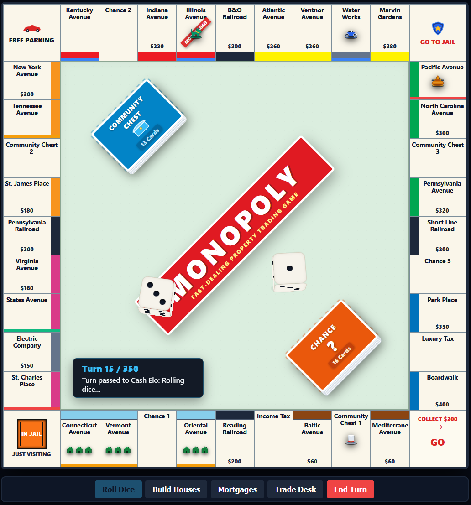

# Monopoly RL

Deep Reinforcement Learning for 4-player Monopoly using Masked Proximal Policy Optimization (PPO), tournament-grade heuristic baselines, and an interactive web arena.

## Overview

Monopoly is an imperfect-information, multi-agent environment featuring stochastic dice rolls, long-term asset management, dynamic liquidity risks, and multi-lateral trading. This repository provides:

1. **Tournament Game Engine (`monopoly_core`)**: Full implementation of official Monopoly rules, including property development, color group monopolies, mortgages, bankruptcy resolution, chance/community chest cards, and open ascending auctions.
2. **Multi-Agent RL Environment (`monopoly_env`)**: Gymnasium-compatible vector observation encoder (board ownership, liquidity, monopolies, building stages) with strict legal action masking across 44 discrete actions.
3. **Neural Architecture (`models`)**: Masked Actor-Critic network with residual MLP blocks, separate policy and value heads, and invalid-action masking via large negative logit penalties.
4. **Agent Suite (`agents`)**:
   - **PPO Agent**: Neural policy trained via self-play and curriculum league training.
   - **Grandmaster Agent**: Tournament heuristic implementing color group prioritization (Orange/Red focus, housing shortages, liquidity management).
   - **Markov Agent**: Expected-value bot based on steady-state transition matrices and landing probabilities.
   - **Baseline Agents**: Random and naive rule-based benchmarks.
   - **LLM Strategist**: Optional local LLM connector (via Ollama) or heuristic fallback for dynamic trade negotiation and dialogue.
5. **Interactive Web Arena (`visualizer` & `play_server.py`)**: Real-time browser interface with board visualization, 3D dice animations, diplomacy chat, and interactive trading/auctions.



---

## Project Structure

```
monopoly_rl/
├── monopoly_core/          # Core game rules, board, cards, auctions, trading
│   ├── board.py            # Board layout and tile state management
│   ├── game.py             # Turn loop, dice, and state machine
│   ├── player.py           # Player state, cash, portfolio, bankruptcy
│   ├── cards.py            # Chance & Community Chest deck mechanics
│   ├── auction.py          # Ascending auction engine
│   └── constants.py        # Tile definitions, prices, color groups
├── monopoly_env/           # Multi-agent RL environment wrapper
│   ├── environment.py      # Step, reset, and reward mechanics
│   ├── action_space.py     # Action enum and legal action masking
│   └── obs_encoder.py      # Observation feature tensor encoding
├── models/                 # Neural network architectures
│   └── actor_critic.py     # Masked Actor-Critic PyTorch model
├── agents/                 # Heuristic and learned agents
│   ├── rl_agent.py         # PyTorch PPO inference wrapper
│   ├── grandmaster_agent.py# Championship heuristic baseline
│   ├── markov_agent.py     # Markov ROI-based baseline
│   ├── baseline_agents.py  # Random and naive heuristics
│   └── llm_strategist.py   # Trade negotiator and dialogue engine
├── checkpoints/            # Trained PyTorch model weights
├── visualizer/             # Frontend assets and board interface
│   └── play.html           # Interactive arena UI
├── play_server.py          # FastAPI backend server for human vs. AI play
├── train.py                # PPO training pipeline
├── train_self_play.py      # Multi-agent self-play training script
├── evaluate.py             # Tournament benchmark evaluator
├── tournament.py           # Head-to-head evaluation harness
└── tests/                  # Pytest test suite for engine and environment
```

---

## Installation

### Prerequisites
- Python 3.10+
- PyTorch 2.0+

```bash
git clone https://github.com/SantiagoSaldanaS/monopoly_rl.git
cd monopoly_rl
pip install -r requirements.txt
```

---

## Quickstart

### 1. Play in the Interactive Arena
Launch the local web server to play against the trained PPO agent and benchmark bots in your browser:

```bash
python play_server.py
```
Then open `http://localhost:8000` in your web browser.

### 2. Evaluate Trained Models
Run head-to-head tournament evaluations between the trained PPO model and benchmark agents:

```bash
python evaluate.py --games 50 --checkpoint checkpoints/monopoly_ppo_final.pt
```

### 3. Train from Scratch
Train a PPO policy against heuristic agents:

```bash
python train.py --episodes 10000 --batch-size 64 --lr 3e-4 --device cuda
```

Or run multi-seat self-play training:

```bash
python train_self_play.py --episodes 10000 --device cuda
```

---

## Running Tests

Run the test suite to verify rules compliance and environment step integrity:

```bash
python -m pytest tests/
```

---

## License

This project is licensed under the MIT License - see the [LICENSE](LICENSE) file for details.
